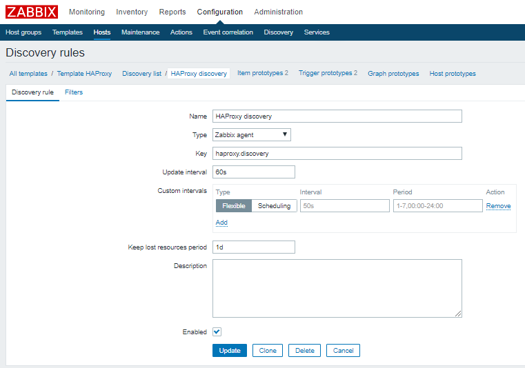
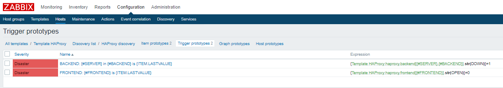

# HAZabbix
Zabbix Discovery and Template for HAProxy 

## Part I : the OS

### 1 - Script

__Discovery bash script__ will return JSON object with servers, backends and frontends from haproxy socket file

Make sure you use  your socket file, mine is /var/run/haproxy.stat

``` bash
cat /etc/zabbix/hazabbix_discovery.sh

#!/bin/bash

echo "show stat" | nc -U /var/run/haproxy.stat | cut -d "," -f 1,2 | column -s, -t | egrep -v 'FRONTEND|BACKEND|svname|pxname' | awk '{ print $2}' > /tmp/hazabbix_discovery_server.txt
echo "show stat" | nc -U /var/run/haproxy.stat | cut -d "," -f 1,2 | column -s, -t | egrep -v 'FRONTEND|BACKEND|svname|pxname' | awk '{ print $1}' > /tmp/hazabbix_discovery_backend.txt
echo "show stat" | nc -U /var/run/haproxy.stat | cut -d "," -f 1,2 | column -s, -t | grep FRONTEND | awk '{ print $1 }'> /tmp/hazabbix_discovery_frontend.txt


declare -a server
readarray -t server < /tmp/hazabbix_discovery_server.txt

declare -a backend
readarray -t backend < /tmp/hazabbix_discovery_backend.txt

declare -a frontend
readarray -t frontend < /tmp/hazabbix_discovery_frontend.txt

q=${#server[@]}
q2=${#frontend[@]}

echo "{"
echo "\"data\":["
for ((i=0;i<$q;i++));
do
    if (( i < $q )); then
        echo  "    {\"{#SERVER}\":\"${server[i]}\",\"{#BACKEND}\":\"${backend[i]}\"},"
    fi
done

for ((i=0;i<$q2;i++));
do
    if (( i < $q2-1 )); then
        echo  "    {\"{#FRONTEND}\":\"${frontend[i]}\"},"
    else
        echo  "    {\"{#FRONTEND}\":\"${frontend[i]}\"}"
    fi
done
echo "]"
echo "}"
```

Note: Do not use the following strings on your back/frontends.

'FRONTEND|BACKEND|svname|pxname'

### 2 - Put in crontab

``` bash
0 23 * * * /etc/zabbix/hazabbix_discovery.sh > /tmp/hazabbix_discovery.txt
```

### 3 - Zabbix Agent

Add UserParameters, then restart it

``` bash
UserParameter=haproxy.discovery, cat /tmp/hazabbix_discovery.txt
UserParameter=haproxy.backend[*],echo "show stat" | nc -U /var/run/haproxy.stat | grep -w $1 | grep -w $2 | cut -d "," -f 18
UserParameter=haproxy.frontend[*],echo "show stat" | nc -U /var/run/haproxy.stat | grep FRONTEND | grep -w $1 | cut -d "," -f 18
```

Then from zabbix server/proxy you can do

``` bash
$ zabbix_get -s 172.27.77.15 -k haproxy.discovery
{
"data":[
    {"{#SERVER}":"eur.gde0","{#BACKEND}":"RLM-Backend"},
    {"{#SERVER}":"eur.gde1","{#BACKEND}":"RLM-Backend"},
    {"{#SERVER}":"dynform0.gde","{#BACKEND}":"Dyn_Forms-Backend"},
    {"{#SERVER}":"dynform1.gde","{#BACKEND}":"Dyn_Forms-Backend"},
    {"{#SERVER}":"dynform2.gde","{#BACKEND}":"Dyn_Forms-Backend"},
    {"{#SERVER}":"dynform3.gde","{#BACKEND}":"Dyn_Forms-Backend"},
    {"{#SERVER}":"mule.gde0","{#BACKEND}":"Mule_ESB-Backend"},
    {"{#SERVER}":"mule.gde1","{#BACKEND}":"Mule_ESB-Backend"},
    {"{#SERVER}":"mule.gde2","{#BACKEND}":"Mule_ESB-Backend"},
    {"{#SERVER}":"mule.gde3","{#BACKEND}":"Mule_ESB-Backend"},
    {"{#SERVER}":"fs.gde","{#BACKEND}":"Webdav-Backend"},
    {"{#SERVER}":"eussnt.gde0","{#BACKEND}":"eussnt-backend"},
    {"{#SERVER}":"eussnt.gde1","{#BACKEND}":"eussnt-backend"},
    {"{#SERVER}":"eussnt.gde2","{#BACKEND}":"eussnt-backend"},
    {"{#SERVER}":"eussnt.gde3","{#BACKEND}":"eussnt-backend"},
    {"{#FRONTEND}":"https"},
    {"{#FRONTEND}":"http-in"},
    {"{#FRONTEND}":"fs.gde-webdav-repo"},
    {"{#FRONTEND}":"mule-gde-tcp-bridge"}
]
}


$ zabbix_get -s 172.27.77.15 -k haproxy.backend[eug.gde1,Gedo-Backend]
UP

$ zabbix_get -s 172.27.77.15 -k haproxy.frontend[fs.gde-webdav-repo]
OPEN
```

## Part II : the frontend

### Create a Template then __Create discovery rule__



### __Create item prototypes__ for front/backends


### __Create trigger prototypes__




Done. Apply to hosts, wait until discovery runs.


__Tip:__ You can use the same logic to discover other stuff.


Enjoy!


